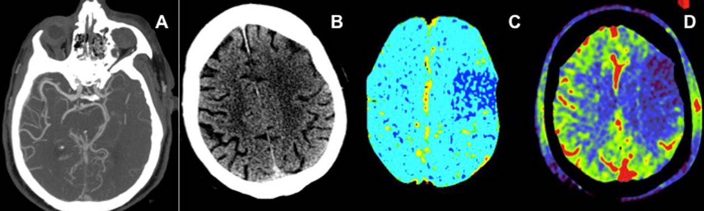

# Stroke Prediction

## *Table of Contents*

1. [Business Case](#business-case)
2. [Project Overview](#project-overview)
3. [Data](#data)
4. [Resources](#resources)
5. [EDA](#eda)
6. [Statistical Analysis](#statistical-analysis)
7. [Predictions](#predictions)
8. [Conclusion](#conclusion)

## *Business Case*

- According to the [World Health Organization (WHO)](https://www.who.int/), stroke is the 2nd leading cause of death globally
- In numbers, that means that stroke corresponds approximately to 11% of total deaths
- A stroke occurs when the blood supply to part of your brain is interrupted or reduced
- This prevents brain tissue from getting oxygen and nutrients and brain cells begin to die in minutes
- Even though it sounds quite deadly, yet up to 80% of strokes can be prevented
- Early action can reduce brain damage and other complications
- Effective treatments can also help prevent disability from stroke

## *Project Overview*

- Our aim in this project is to understand the reasons that cause stroke and see whether we can detect it
- In particular, we try to understand the relationship between different characteristics and stroke
- We use inferential statistic methods to study how different characteristics influence the occurence of stroke
- Finally, we try to see if we can successfully detect a possible stroke incident using machine learning

## *Data*

- The data were acquired from [kaggle](https://www.kaggle.com/fedesoriano/stroke-prediction-dataset)
- They contain several parameters such as gender, age, various diseases, smoking status, body mass index etc.
- The dataset was quite imbalanced, with only about $5\\%$ of the people having experienced stroke

## *Resources*

- Packages: `numpy`, `pandas`, `matplotlib`, `seaborn`, `scipy`, `statsmodels`, `sklearn`, `imblearn`, `lightgbm`
- Software: Jupyter Notebook

## *EDA*

- In this section, we analyze the data using visual techniques
- We look for patterns and common characteristics between people who have experienced stroke

### Demographics

- Stroke probability for those who have a marriage history is higher than for those who don't
- A person who is married (or has been in the past) is approximately 4 times more likely to experience stroke

### Work Type & Smoking Status

- According to the graphs, the work type does not seem to affect the occurence of a stroke
- Also, contrary to what we would expect, smoking status does not seem to be associated with stroke

### Hypertension & Heart Disease

- It seems than a person with hypertension is approximately 3x more likely to experience stroke
- In addition, a person with heart disease is approximately 4x more likely to experience stroke
- Therefore, we could claim that both features could be indicators of a possible stroke incident

### Age, Glucose Level & Body Mass Index

- According to the graphs, it is obvious that older people experience stroke much more often than younger ones
- On the other hand, the glucose level and the BMI do not seem to be strong indicators of a possible stroke

## *Statistical Analysis*

- In this section, we analyze the data using statistical techniques
- Specifically, we try to understand the relationship between different characteristics and stroke
- Our goal is to find which features could potentially be strong indicators of a possible stroke

### Pairwise Feature Correlation

- We observe that there is no pair of strongly linearly correlated features
- The feature with which stroke seems to be mostly associated is age, which we observed earlier
- In addition, age and body mass index appear to have a moderate linear correlation
- This, in fact, makes sense given thah people tend to exercise less as they grow older

### Feature Significance via OLS Regreesion

*Hypothesis*

- $H0:$ There is a linear relationship between `feature_name` and stroke
- $H1:$ There is no linear relationship between `feature_name` and stroke

*Results*

- We ***reject*** the null hypothesis if $p$-value $< 0.05$
- Any feature with $p$-value $< 0.05$ is considered statistically significant
- Simply put, people with these characteristics are more likely to have a stroke

## *Predictions*

- For our predictions, we use 6 classifiers
- We, also, use `GridSearchCV` with a 5-fold stratified cross validation to tune some of their hyperparameters
- The results obtained from each of them can be found in the table below

|   | Precision | Recall | F1 Score | ROC | Accuracy |
| - | :-------: | :----: | :------: | :-: | :------: |
| LogisticRegression | 0.172414 | 0.60 | 0.267857 | 0.725926 | 0.839530 |
| KNN | 0.119658 | 0.28 | 0.167665 | 0.587016 | 0.863992 |
| DecisionTree | 0.125000 | 0.28 | 0.172840 | 0.589588 | 0.868885 |
| ExtraTrees | 0.155844 | 0.24 | 0.188976 | 0.586564 | 0.899217 |
| RandomForest | 0.149254 | 0.20 | 0.170940 | 0.570679 | 0.905088 |
| LightGBM | 0.146341 | 0.12 | 0.131868 | 0.541996 | 0.922701 |

## *Conclusion*

In order to choose the model that meets our needs, we need to ask ourselves "*why should I predict this?*". In this case, the answer is that we would like to offer some kind of medical advice and/or preventative treatment to those who we predict are more likely to have a stroke. In other words, we want a model that can predict as many *true positives* and as few *false negatives* as possible. Therefore, we should look for a model with *high recall*. That being said, the model which yields the highest recall is ***Logistic Regression***, achieving a value of 60%.
